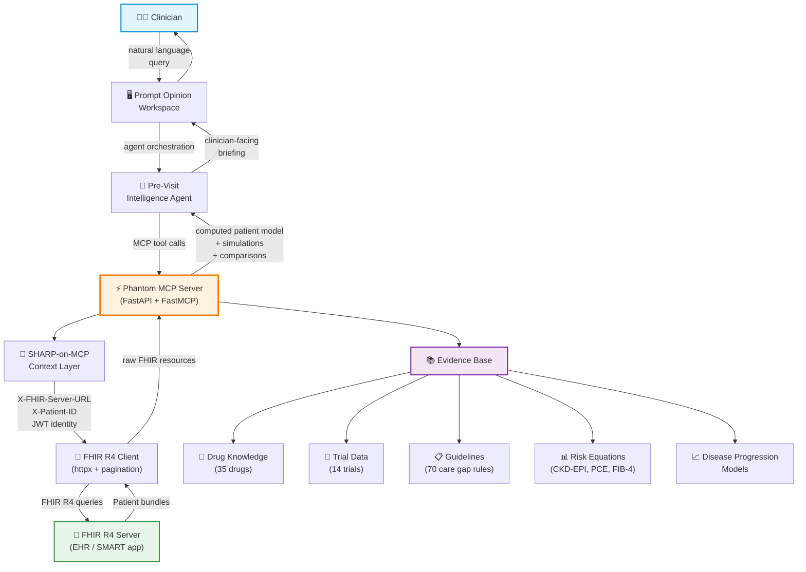
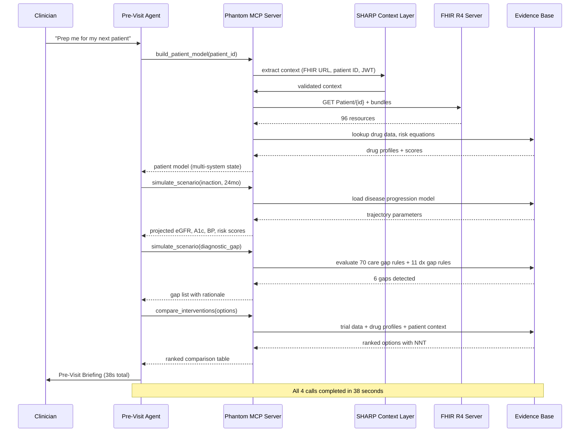
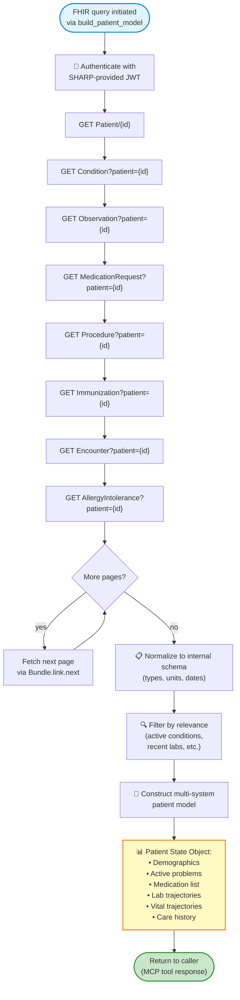
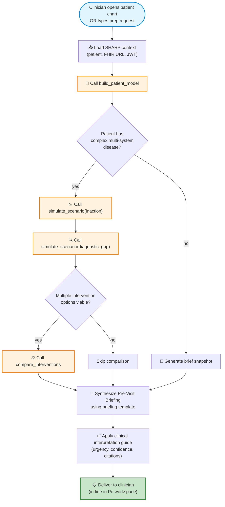
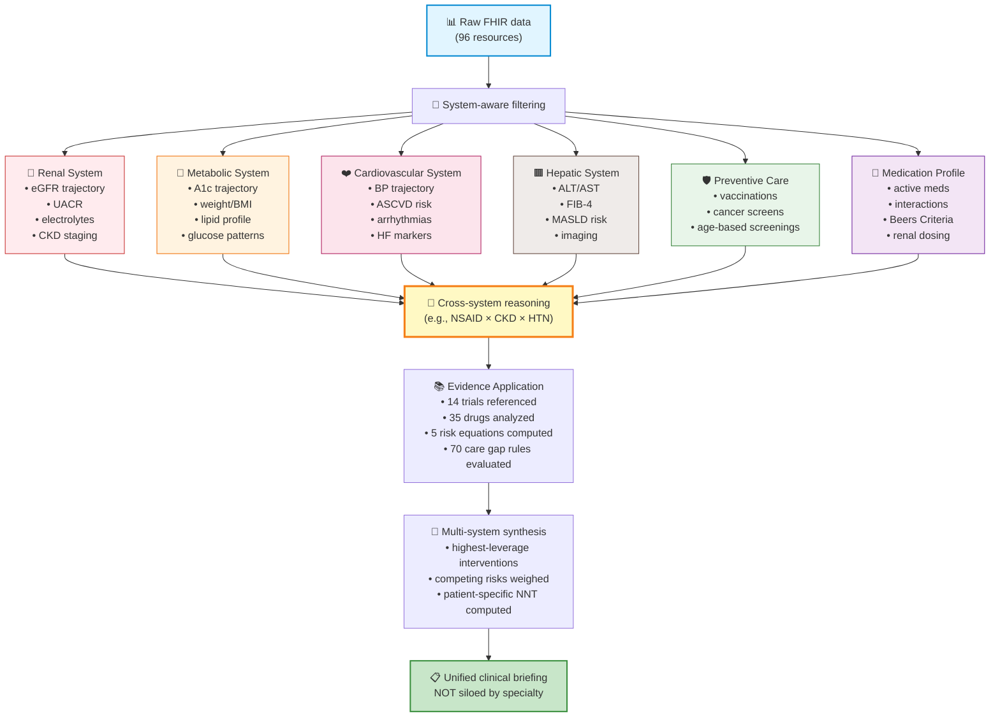

# Phantom Architecture Diagrams

> Visual reference for Phantom's system design, data flow, and
> standards-based composability. All diagrams use Mermaid syntax and
> render natively on GitHub.
>
> **Audience:** developers integrating with Phantom, agent designers,
> hackathon judges, technical reviewers.

---

## Table of Contents

1. [Full Phantom System Architecture](#1-full-phantom-system-architecture)
2. [MCP Tool Invocation Flow](#2-mcp-tool-invocation-flow)
3. [SHARP Context Propagation](#3-sharp-context-propagation)
4. [FHIR Data Processing Pipeline](#4-fhir-data-processing-pipeline)
5. [Pre-Visit Agent Workflow](#5-pre-visit-agent-workflow)
6. [Multi-System Clinical Reasoning Pipeline](#6-multi-system-clinical-reasoning-pipeline)

---

## 1. Full Phantom System Architecture

**Why this architecture matters:**

- **Standards-native:** Every layer speaks an open standard (MCP, SHARP,
  FHIR R4). No proprietary protocols.
- **Composable:** The same Phantom MCP server can serve any agent on any
  MCP-compatible platform — not just Po, not just Pre-Visit Agent.
- **Decoupled evidence base:** The clinical knowledge (drugs, trials,
  guidelines) is independent of the orchestration logic. Updates to
  evidence don't require code changes to consumers.
- **Pluggable FHIR backend:** Phantom doesn't care whether the FHIR
  server is HAPI, Epic, Cerner, or a sandbox — only that it speaks
  FHIR R4.

---

## 2. MCP Tool Invocation Flow

**Why this flow matters:**

- **Composability of tools:** The agent chains 3 distinct MCP tool calls
  to produce one briefing. Each tool is independently callable and
  reusable.
- **Evidence base reuse:** The same evidence base is queried across
  multiple tool invocations — no duplicate lookups, fast in aggregate.
- **Single context propagation:** SHARP context is extracted once, used
  across all subsequent FHIR calls — no re-authentication required.
- **Time-bounded:** Total generation time (~38 seconds) is suitable for
  pre-visit workflows.

---

## 3. SHARP Context Propagation

```mermaid
flowchart LR
    EHRSession["🏥 EHR Patient Session<br/>(Maria Santos chart open)"]
    SMARTLaunch["🚀 SMART App Launch<br/>JWT issued"]
    PoWorkspace["🖥️ Po Workspace<br/>(receives SHARP context)"]
    Agent["🤖 Pre-Visit Agent"]
    MCPHeaders["📨 MCP Request Headers<br/>X-FHIR-Server-URL<br/>X-Patient-ID<br/>Authorization: Bearer {JWT}"]
    PhantomServer["⚡ Phantom MCP Server<br/>(extracts from headers)"]
    SHARPLayer["🔐 SHARP Layer<br/>validates + parses"]
    PatientContext["✅ Validated Context:<br/>• FHIR URL<br/>• Patient ID<br/>• Clinician identity<br/>• Authorized scopes"]
    FHIRCall["📡 Authenticated FHIR call<br/>with patient ID injected"]

    EHRSession --> SMARTLaunch
    SMARTLaunch -->|"OAuth + scopes"| PoWorkspace
    PoWorkspace -->|"SHARP context attached"| Agent
    Agent -->|"MCP tool call"| MCPHeaders
    MCPHeaders --> PhantomServer
    PhantomServer --> SHARPLayer
    SHARPLayer --> PatientContext
    PatientContext --> FHIRCall

    style EHRSession fill:#e8f5e9,stroke:#388e3c,stroke-width:2px
    style PatientContext fill:#fff9c4,stroke:#f57f17,stroke-width:2px
    style PhantomServer fill:#fff3e0,stroke:#f57c00,stroke-width:3px
```

**Why SHARP matters:**

- **No manual patient ID entry:** The clinician's EHR session
  automatically scopes every Phantom tool call to the right patient.
- **Security-first:** OAuth scopes and JWT identity are propagated and
  validated — the agent cannot exceed authorized scopes.
- **Auditable:** Every Phantom call is traceable to a clinician identity
  and a specific patient context — meets healthcare audit requirements.
- **Vendor-neutral:** SHARP-on-MCP works with any EHR that supports
  SMART on FHIR — not locked to a specific vendor.

---

## 4. FHIR Data Processing Pipeline

**Why this pipeline matters:**

- **Pagination-aware:** Real patient charts can have hundreds of
  observations across many years. Phantom handles paginated bundles
  natively.
- **Type and unit normalization:** FHIR servers vary — Phantom converts
  everything to a consistent internal schema (e.g., glucose always in
  mg/dL, eGFR always in mL/min/1.73m²).
- **Clinical relevance filtering:** Not every resource matters for every
  decision. Phantom filters to active and clinically relevant data
  before model construction.
- **Reusable model:** Once built, the patient model is cached for
  subsequent tool calls in the same session — avoiding redundant FHIR
  queries.

---

## 5. Pre-Visit Agent Workflow

**Why this workflow matters:**

- **Conditional tool invocation:** The agent doesn't always call all
  3 tools — simple cases get a lightweight briefing, complex cases get
  the full pipeline. Saves time and tokens.
- **Decision points are explicit:** The branches in the workflow reflect
  real clinical reasoning patterns, not arbitrary rules.
- **Quality gating:** Before delivery, every briefing passes through the
  clinical interpretation guide for tone, urgency, and citation
  consistency.
- **Reproducible:** The same workflow runs the same way for every
  patient — no improvisation.

---

## 6. Multi-System Clinical Reasoning Pipeline

**Why multi-system reasoning matters:**

- **Real patients have multimorbidity:** Maria Santos has 5 active
  conditions across 4 organ systems. Single-axis reasoning would miss
  the highest-leverage interventions.
- **Cross-system effects are common:** NSAID + CKD + HTN is one of the
  most clinically dangerous combinations, and is invisible to any system
  that reasons one organ at a time.
- **Single intervention, multi-system benefit:** SGLT2 inhibitors
  improve renal AND cardiovascular AND metabolic outcomes
  simultaneously. Phantom surfaces this multi-system leverage explicitly.
- **Specialty silos break down:** Cardiologists see hearts. Nephrologists
  see kidneys. Phantom sees patients.

---

## Interoperability Significance

The architecture above is built entirely on open standards:

| Standard | Role in Phantom | Why it matters |
|----------|----------------|----------------|
| **MCP** (Model Context Protocol) | Tool exposure to agents | Any MCP-compatible agent can equip Phantom |
| **A2A** (Agent-to-Agent) | Inter-agent composition | Phantom can be invoked by other agents in chains |
| **SHARP-on-MCP** | Healthcare context propagation | Patient/clinician identity flows securely through MCP |
| **FHIR R4** (HL7) | Patient data substrate | Vendor-neutral, used by every modern EHR |
| **SMART on FHIR** | OAuth + scoped access | Industry-standard healthcare auth |

**The architectural payoff:** Phantom is not a Po-specific tool. It is a
standards-native clinical reasoning service that can plug into any
agent platform that supports MCP, with any FHIR-compatible EHR backend,
authenticated by any SMART-on-FHIR identity provider.

This is the difference between building a hackathon demo and building
infrastructure.

---

## Diagram Maintenance Notes

- All diagrams use Mermaid syntax — render automatically on GitHub
- To preview locally, install the Mermaid VS Code extension
- Update diagrams when:
  - New MCP tools are added
  - SHARP integration evolves
  - Evidence base structure changes significantly
- Keep diagrams in sync with `docs/architecture.md` prose

---

*Phantom — Architecture Diagrams — `docs/architecture_diagrams.md`*
*Maintained alongside the system implementation.*